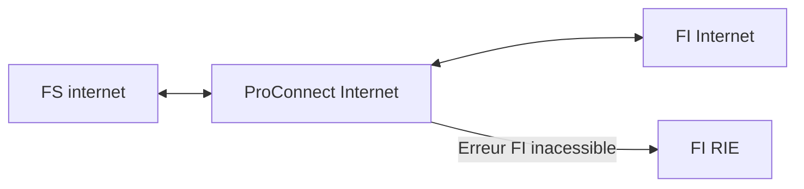
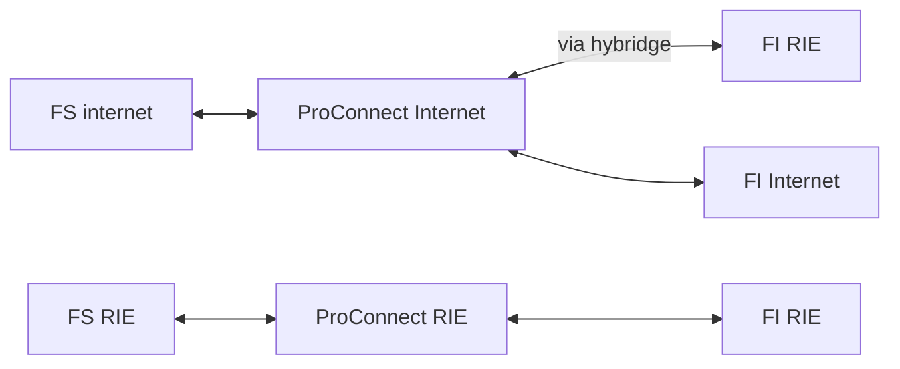

# Qu'est-ce que la plateforme "Internet", la plateforme "RIE" et l'"Hybridge" ?

ProConnect est implémenté sur deux plateformes, une dite "full RIE" et une autre dite "full Internet". Toutefois il
est possible de communiquer entre les deux plateformes grâce à "l'Hybridge Internet/RIE".

Le choix du positionnement sur le RIE ou sur Internet est « à la main » des Fournisseurs d'Identité et des Fournisseurs
de Services.

## Les plateformes d’ProConnect

ProConnect met à disposition 3 plateformes pour répondre aux exigences de l’ANSSI.

### La plateforme « Internet »

L'agent se connecte depuis Internet, à un Fournisseur de Services Internet via un Fournisseur d'Identité Internet.

Ex : Accès à l’outil collaboratif Osmose depuis le FI Cerbère (MTE)

### La plateforme « RIE »

L’agent se connecte depuis le RIE, à un Fournisseur de Services RIE via un Fournisseur d'Identité RIE.

Ex : Accès au portail du CISIRH depuis l’annuaire Passage 2 (MI)

### La plateforme Hybridge ProConnect RIE-Internet

L'Hybridge permet de relier un Fournisseur d’Identité RIE à un Fournisseur de Services Internet (et non l'inverse)

| *FI/FS*                             | Fournisseur de Services RIE | Fournisseur de Services Internet |
|-------------------------------------|-----------------------------|----------------------------------| 
| **Fournisseur d'Identité RIE**      | Oui                         | Oui (via l'Hybridge)             |
| **Fournisseur d'Identité Internet** | Non                         | Oui                              |

## Schémas synthétiques des connexions RIE et Internet

Une agente peut se connecter depuis un contexte internet ou RIE à une instance ProConnect. Voici le récapitulatif des connexions possibles.

### Contexte Internet

## Connexion contexte RIE

