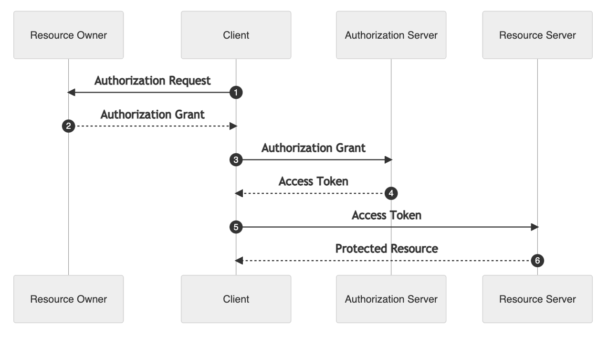

# Qu'est ce que le protocole OpenID Connect ?

Le protocole OpenID Connect est au cœur du fonctionnement d'AgentConnect. C'est une couche d'identification basée sur protocole OAuth 2.0. Il permet à des *Clients* d'accéder à l'identité des *Utilisateurs*  par l'intermédiaire d'un *Serveur d'Autorisation* .

La spécification du protocole se trouve sur http://openid.net/connect/.

Pour une référence d'implémentation OpenID Connect voici le lien : https://openid.net/specs/openid-connect-core-1_0.html#CodeFlowAuth

## Les flux standards

Le protocole OpenID Connect définit 3 appels REST faits par le client, et 4 endpoints (un du côté client, et trois du côté provider).

En amont, le client s'inscrit (en général manuellement) auprès du provider. Il lui fournit une URL de callback (l'URL du client vers lequel l'internaute est redirigé une fois authentifié), aussi appelée "callback endpoint". En retour le provider donne au client un client ID et un client secret.

Lorsque l'utilisateur clique sur le bouton d'authentification du client, le flux est le suivant :

Le client fait une redirection vers le "authorization endpoint" du provider avec son client id et son url de callback. Le provider redirige alors l'internaute vers sa mire d'authentification. 

Si l'internaute se loggue correctement, le provider renvoie un code d'autorisation au client.

Le client fait un appel Web service vers le "token endpoint" du provider avec le code d'autorisation reçu, et authentifie cette requête avec son client id et son client secret. 

Le provider retourne un access token (une chaîne de caractères encodée en base64), un id token (sous la forme d'un Json Web Token, voir https://developer.atlassian.com/cloud/jira/service-desk/understanding-jwt/), et parfois un refresh token (une chaîne de caractères en base64).

Le client fait un appel Web service vers le "userInfo endpoint" du provider avec l'access token reçu, et le provider renvoie les informations de l'internaute au client.

## Qu'est ce que le protocole OAuth 2.0

OAuth 2.0 est un protocole destiné délégué les accès à des resources. Son objectif est de décrire comment l'accès à des ressources, des données, exposées par exemple sous la forme d'API sécurisé, peut être délégué à un client, une application ou un service en ligne, en ayant recueilli l'autorisation de l'utilisateur. 

Ce protocole fait intervenir quatre acteurs : 

* *Resource owner* : il s'agit de la personne qui est propriétaire des resources, le plus souvent c'est l'utilisateur; 
* *Resource server* : il s'agit du serveur qui héberge les resources du *Resource owner*; 
* *Client* : il s'agit de l'application ou du service qui souhaite accéder aux ressources
* *Authorization Server* : Il s'agit du serveur qui recueiller les autorisations des propriétaires des ressources et génère le jeton d'autorisation qui sont utilisé pour accéder aux ressources. 

Le serveur d'autorisation gère deux types de jetons : 
* *access token* : jeton qui permet de valider l'accès à un ressource. La durée de validité de ce jeton est limité et généralement de l'ordre de quelques minutes; 
* *refresh token* : jeton qui permet de renouveller l'autorisation sans la demander à nouveau au propriétaire de la ressource. Il permet de récupérer un nouvel *access token*. La durée de validité de ce jeton est généralement de plusieurs jours voir de plusieurs mois. Ce jeton doit être stocké de manière sécurisé par le client.

Les clients doivent être déclarés auprès du serveur d'autorisation. Les informations à fournir par le client sont : 
- le nom de l'application
- la liste des urls de redirections : il s'agit des urls vers lesquelles les utilisateurs vont être redirigé par le serveur d'autorisation, une fois l'autorisation accordé.
- les types d'autorisation qui pourront être utilisé par le client

Une fois déclarée, le serveur d'autorisation fourni au client un couple de client_id / client_secret qui permettra d'autthenfier le client auprès du serveur d'autorisation. 

Le diagramme de séquence représente de manière générale les intégrations dans une cinématique OAuth 2.0

1. Le client demande un accès au ressource auprès du proriétaire des ressources ( *resource owner ) en précisant le périmètre de la demande à l'aide de scopes. Le client s'identifie à l'aide de son client_id et indique le type d'autorisation demandée. 

2. Si le propriétaire de la ressource accepte d'accorder l'accès à ces ressources, une autorisation d'accès est délivrer au client

3. Le client demande auprès du serveur d'autorisation un jeton d'accès ( *access token* ) en s'authentifiant et en fournissant l'autorisation d'accès reçu à l'étape précédente. 

4. Le serveur d'autorisation fourni un jeton d'accès après avoir authentifié le client et vérifier la validité de l'autorisation d'accès. 

5. Le client demande des ressources au serveur de ressources en fournissant l'access token fourni par le serveur d'autorisations.

6. Le serveur de ressources retournes les ressources demandés en ayant au préalable vérifié la validité de l'access token. 

OAuth 2.0 propose les types d'autorisations suivants: authorization code, implicit, resource owner credentials, client credentials.

Il faut noter que le protocole OAuth 2.O ne gère pas l'authentification de l'utilisateur. L'identité de l'utilisateur ne permet pas au client d'accéder au informations d'identités de l'utilisateur. Afin de rajouter ces informations, le protocole Openid Connect étant OAuth 2.0 pour intégrer l'accès aux informations d'identités de l'utilisateur. 

## Qu'apporte OpenId Connect à OAuth 2.0 ? 

Le protocole OpenId Connect s'appuie sur OAuth 2.0 en ajoutant des fonctionnalités supplémentaires : 

- La gestion d'information sur l'authentification,
- l'ajout d'un ID Token,
- la gestion d'un SSO et d'un déconnection,
- une API pour récupérer les informations sur l'utilisateur (/userinfo),
- un standard sur les informations sur l'utilisateur,
- un service de découverte des informations du serveur OpenID. 

### Quels sont les acteurs qui interviennent dans  OpenId Connect ?

Pour rappel, le protocole OpenID Connect défini les acteurs suivants : *User*, *Relying Party* et *OpenID Provider*. 

OpenId Connect fait intervenir 3 acteurs : 

| Acteur OpenId Connect | Acteur dans le contexte AgentConnect |
| ------ | ------ |
| User |  Usager du Fournisseur de Services |
| Relying Party | Fournisseur de Services | 
| OpenID Provider | AgentConnect |

Les Fournisseurs de Services doivent donc être des clients OpenID Connect (aussi appelés relying parties), et les Fournisseurs d'Identité doivent être des fournisseurs OpenID Connect (aussi appelés providers).

---

Voir aussi : 
