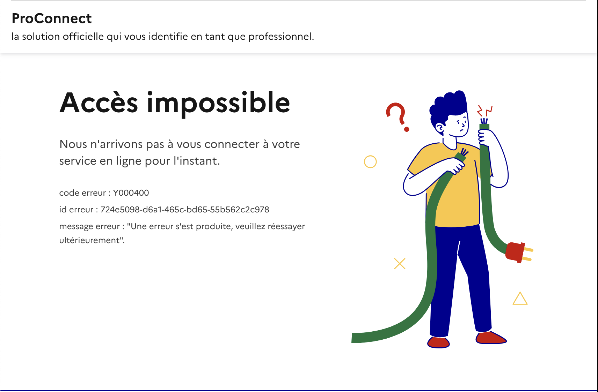

[Accueil](../README.md) > [ProConnect - Fournisseur de Service](README.md) > Aide et support

---

# 🆘 Aide et support de ProConnect

Votre implémentation vous renvoie une erreur ? Cette rubrique vous donne la marche à suivre pour vous débloquer dans les meilleures conditions.

## 1. Erreurs récurrentes

Avant toute chose, nous avons noté [quelques erreurs récurrentes qui peuvent apporter des premiers éléments de débogage](./troubleshooting-fs.md). 

Si cela n'est pas suffisant, voici la marche à suivre pour vous aider.

## 2. Contacter le support de ProConnect

### 2.1. Canaux de communication

Comme ces conversations peuvent envoyer de gros messages, nous vous recommandons de passer par notre email : support+partenaires@proconnect.gouv.fr

Vous pouvez utiliser notre chaine Tchap pour faire des pré-questions avant la demande d'aide.

### 2.2. Les éléments à nous envoyer

ProConnect a plusieurs centaines d'applications autorisées sur 4 bases de données (Internet/RIE & Integ/Prod), il est parfois compliqué de s'y retrouver. Ainsi, pour avoir une aide rapide et efficace, nous vous demanderons de nous envoyer :

- une mise en contexte du problème
- le `client_id` de l'application
- l'environnement (`intégration` ou `production`)
- le réseau (`RIE` ou `Internet`)
- l'URL de la route / authorize complète (généralement au format `https://fca.integ01.dev-agentconnect.fr/api/v2/authorize?acr_values=eidas1&client_id=492739239028-e6dc-41b1-9586-9516a82bcd03&nonce=agent_connect_nonce_D2S2eZwHL6rWtDQUg3c37PHyo3LpqtHn&redirect_uri=https://monurl.gouv.fr/agent_connect/callback&response_type=code&scope=openid email given_name usual_name&state=agent_connect_state_2yB6wdmHQbjHs8qrJDBD1tyKdc3ijKu6
`)
- le code erreur (généralement au format `Y090329302`)
- l'ID complète de l'erreur (généralement au format `724e5098-d6a1-465c-bd65-55b562c2c978`)

Avec ceci, nous devrions avoir les armes pour vous apporter des éléments d'aide.
